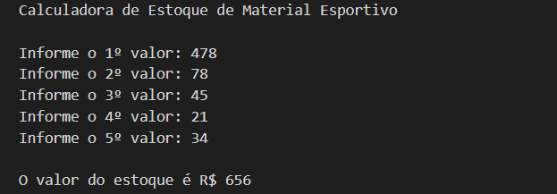

# ESTOQUE DE MATERIAL ESPORTIVO
👨‍🏫ESTE PROGRAMA EM PORTUGOL CALCULA O VALOR TOTAL EM ESTOQUE DE UMA LOJA DE MATERIAL ESPORTIVO.

  

## DESCRIÇÃO:
Este programa em Portugol calcula o valor total em estoque de uma loja de material esportivo. Ele solicita ao usuário que insira os preços unitários de cinco produtos diferentes e, em seguida, calcula e exibe o valor total desses produtos em estoque.

## FUNCIONALIDADES:
1. **Entrada de Dados Validada**:
   - O programa solicita ao usuário os preços unitários de cinco produtos.
   - Cada preço inserido é validado para garantir que seja um número real válido.

2. **Cálculo do Valor Total em Estoque**:
   - Após a entrada dos preços, o programa calcula o valor total em estoque somando todos os valores inseridos.

3. **Saída do Resultado**:
   - Exibe o valor total em estoque formatado como "O valor do estoque é R$ X.XX".

4. **Validação de Entradas**:
   - Assegura que apenas valores numéricos sejam aceitos como entrada para os preços unitários.

## COMO USAR?
1. **Execução do Programa**:
   - Abra o Portugol Studio.
   - Crie um novo projeto e cole o código fornecido.
   - Compile e execute o programa.

2. **Interagindo com o Programa**:
   - Ao iniciar, o programa exibirá uma mensagem de boas-vindas e solicitará que você insira os preços unitários de cinco produtos.
   - Para cada produto, digite o preço e pressione Enter.
   - O programa validarará cada preço para garantir que seja um número real positivo.
   - Após inserir os preços dos cinco produtos, o programa calculará e exibirá o valor total em estoque formatado corretamente.

## NÃO SABE?
- Entendemos que para manipular arquivos em muitas linguagens e tecnologias, é necessário possuir conhecimento nessas áreas. Para auxiliar nesse aprendizado, oferecemos cursos gratuitos disponíveis:
* [CURSO DE PORTUGOL](https://github.com/VILHALVA/CURSO-DE-PORTUGOL)
* [CONFIRA MAIS CURSOS](https://github.com/VILHALVA?tab=repositories&q=+topic:CURSO)

## CREDITOS:
- [PROJETO CRIADO PELO VILHALVA](https://github.com/VILHALVA)

